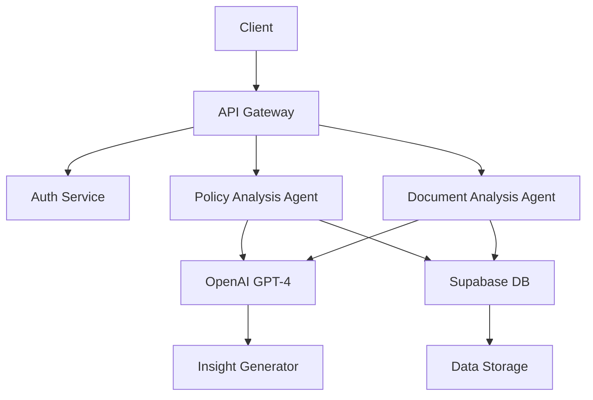

# PolicySphere AI — Agent Architecture

## Overview

PolicySphere AI is an autonomous policy risk analysis platform powered by AI agents. The system uses multi-agent orchestration to analyze, evaluate, and provide insights on government policies.

---

## Agent Architecture

```
┌─────────────────────────────────────────────────────────────────────────┐
│                           CLIENT (Frontend)                              │
│  ┌─────────┐  ┌─────────┐  ┌─────────┐  ┌─────────┐  ┌─────────────┐  │
│  │ Landing │  │Dashboard│  │ Policy  │  │ Document│  │ Risk Reports│  │
│  │  Page   │  │         │  │Simulator│  │ Analyzer│  │             │  │
│  └────┬────┘  └────┬────┘  └────┬────┘  └────┬────┘  └──────┬──────┘  │
└───────┼────────────┼────────────┼────────────┼──────────────┼─────────┘
        │            │            │            │              │
        └────────────┴────────────┴────────────┴──────────────┘
                                      │
                                      ▼
┌─────────────────────────────────────────────────────────────────────────┐
│                           API GATEWAY                                    │
│  ┌──────────────────────────────────────────────────────────────────┐   │
│  │                    Express.js Server                              │   │
│  │  • Rate Limiting    • Authentication    • Request Validation     │   │
│  └──────────────────────────────────────────────────────────────────┘   │
└─────────────────────────────────────────────────────────────────────────┘
                                      │
                                      ▼
┌─────────────────────────────────────────────────────────────────────────┐
│                        AGENT ORCHESTRATOR LAYER                          │
│  ┌────────────────────────────────────────────────────────────────┐     │
│  │                    PolicyAnalysisAgent                          │     │
│  │  ┌────────────┐  ┌────────────┐  ┌────────────┐  ┌──────────┐  │     │
│  │  │  Policy     │  │ Economic   │  │  Risk      │  │ Insight  │  │     │
│  │  │  Parser    │  │  Modeler   │  │  Assessor │  │ Generator│  │     │
│  │  └────────────┘  └────────────┘  └────────────┘  └──────────┘  │     │
│  └────────────────────────────────────────────────────────────────┘     │
│                                                                         │
│  ┌────────────────────────────────────────────────────────────────┐     │
│  │                  DocumentAnalysisAgent                          │     │
│  │  ┌────────────┐  ┌────────────┐  ┌────────────┐  ┌──────────┐  │     │
│  │  │  Text      │  │  URL      │  │  Summary  │  │ Q&A      │  │     │
│  │  │  Extractor │  │  Fetcher  │  │  Generator│  │ Engine   │  │     │
│  │  └────────────┘  └────────────┘  └────────────┘  └──────────┘  │     │
│  └────────────────────────────────────────────────────────────────┘     │
└─────────────────────────────────────────────────────────────────────────┘
                                      │
                                      ▼
┌─────────────────────────────────────────────────────────────────────────┐
│                      CORE SERVICES LAYER                                │
│  ┌──────────────────┐  ┌──────────────────┐  ┌────────────────────┐   │
│  │  OpenAI Service  │  │  Supabase Client │  │  Policy Templates  │   │
│  │  • GPT-4        │  │  • Auth          │  │  • Tax Policies   │   │
│  │  • Embeddings   │  │  • Database      │  │  • Regulations    │   │
│  │  • Function     │  │  • Storage       │  │  • Subsidies      │   │
│  └──────────────────┘  └──────────────────┘  └────────────────────┘   │
└─────────────────────────────────────────────────────────────────────────┘
                                      │
                                      ▼
┌─────────────────────────────────────────────────────────────────────────┐
│                         DATA LAYER                                      │
│  ┌─────────────┐  ┌─────────────┐  ┌─────────────┐  ┌─────────────┐   │
│  │  Users      │  │  Analyses   │  │  Reports    │  │  Documents  │   │
│  │  Table      │  │  Table      │  │  Table      │  │  Table      │   │
│  └─────────────┘  └─────────────┘  └─────────────┘  └─────────────┘   │
└─────────────────────────────────────────────────────────────────────────┘
```

---

## Agent Components

### 1. PolicyAnalysisAgent

**Purpose**: Core agent for policy impact analysis

**Sub-Agents**:
| Agent | Function |
|-------|----------|
| PolicyParser | Parses user input (type, sector, magnitude, duration) |
| EconomicModeler | Runs economic simulations and calculations |
| RiskAssessor | Calculates risk scores (0-100) across 4 metrics |
| InsightGenerator | Generates AI-powered explanations and recommendations |

**Workflow**:
```
User Input → PolicyParser → EconomicModeler → RiskAssessor → InsightGenerator → Response
```

**Risk Metrics**:
- Inflation Impact
- Employment Effect  
- GDP Growth
- Fiscal Deficit

---

### 2. DocumentAnalysisAgent

**Purpose**: Analyze policy documents and URLs

**Sub-Agents**:
| Agent | Function |
|-------|----------|
| TextExtractor | Extract and clean policy text from documents |
| URLFetcher | Fetch content from policy URLs |
| SummaryGenerator | Generate AI summaries of documents |
| QAEngine | Answer questions about uploaded documents |

**Workflow**:
```
Upload/URL → Extractor/Fetcher → SummaryGenerator → QAEngine → Response
```

---

### 3. InsightGeneratorAgent

**Purpose**: Generate actionable insights from analysis

**Features**:
- Natural language explanations
- Decision recommendations (Proceed/Review/Reject)
- Confidence scores
- Comparative analysis

---

## API Endpoints

### Authentication
| Method | Endpoint | Description |
|--------|----------|-------------|
| POST | `/api/auth/register` | Register new user |
| POST | `/api/auth/login` | Login user |
| POST | `/api/auth/logout` | Logout user |

### Policy Analysis
| Method | Endpoint | Description |
|--------|----------|-------------|
| POST | `/api/policy/analyze` | Analyze policy impact |
| GET | `/api/policy/templates` | Get policy templates |
| POST | `/api/policy/compare` | Compare two policies |

### Document Analysis
| Method | Endpoint | Description |
|--------|----------|-------------|
| POST | `/api/document/analyze-text` | Analyze pasted text |
| POST | `/api/document/analyze-url` | Analyze URL content |
| POST | `/api/document/question` | Ask question about document |

### User Data
| Method | Endpoint | Description |
|--------|----------|-------------|
| GET | `/api/analyses` | Get user's analyses |
| GET | `/api/analyses/:id` | Get specific analysis |
| DELETE | `/api/analyses/:id` | Delete analysis |
| GET | `/api/stats` | Get user statistics |

---

## Data Models

### User
```typescript
interface User {
  id: string;
  email: string;
  username: string;
  created_at: timestamp;
  settings: JSON;
}
```

### Analysis
```typescript
interface Analysis {
  id: string;
  user_id: string;
  title: string;
  policy_type: 'tax' | 'subsidy' | 'regulation';
  sector: string;
  magnitude: number;
  duration: 'short' | 'long';
  impacts: {
    inflation: number;
    employment: number;
    gdp: number;
    fiscal: number;
  };
  risk_score: number;
  decision: 'proceed' | 'review' | 'reject';
  explanation: string;
  analyzed_at: timestamp;
}
```

---

## Security

- **Authentication**: Supabase Auth (JWT)
- **Authorization**: Row Level Security (RLS)
- **Rate Limiting**: 100 requests/15 minutes
- **Input Validation**: express-validator
- **Helmet**: Security headers

---

## Deployment

### Backend
```bash
cd backend
npm install
npm run dev
```

### Frontend
```bash
cd frontend
npm install
npm run dev
```

### Environment Variables
```
SUPABASE_URL=your_supabase_url
SUPABASE_ANON_KEY=your_anon_key
OPENAI_API_KEY=your_openai_key
JWT_SECRET=your_jwt_secret
```

---

## Future Enhancements

1. **Multi-Agent Collaboration** - Agents communicate to solve complex policies
2. **Real-time Data** - Integration with economic databases
3. **Custom Models** - Fine-tuned models for specific sectors
4. **Mobile App** - Native iOS/Android applications
5. **Team Collaboration** - Shared workspaces for organizations

---

## Architecture Diagram (Mermaid)



---

*Last Updated: April 2026*
*Version: 1.0.0*