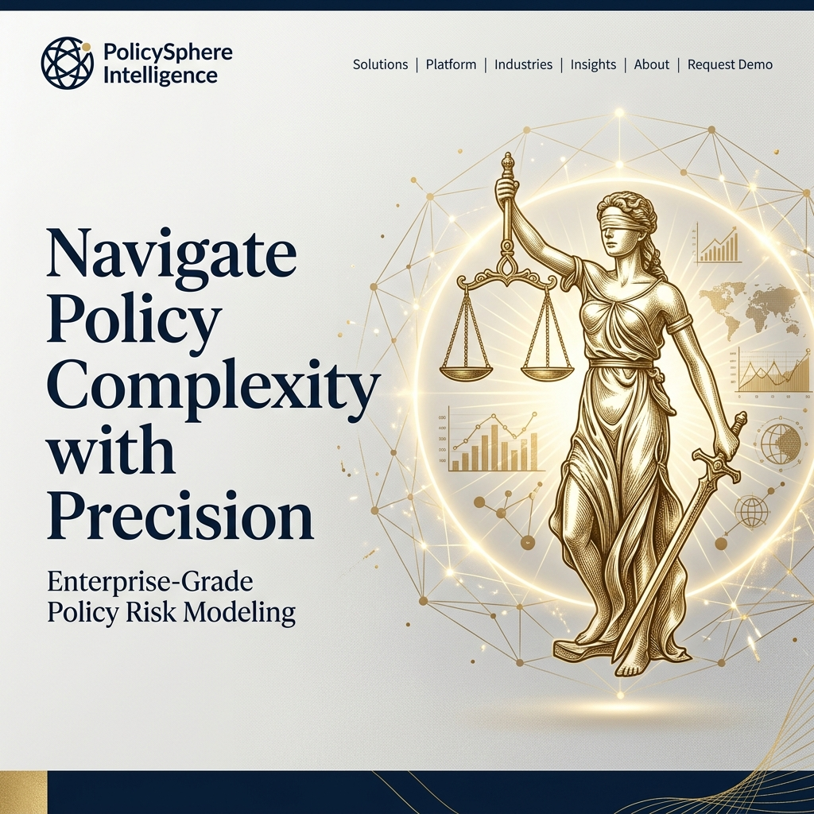

# PolicySphere AI 🌍

<p align="center">
  
</p>

<p align="center">
  
  
  
  
</p>

> **Autonomous Decision Engine for Policy Risk Analysis**
>
> An intelligent platform that simulates economic impacts, evaluates risks, and provides data-driven recommendations for policy decisions using enterprise-grade AI.

---

## ✨ Why PolicySphere?

<p align="center">
  
  
  
  
</p>

PolicySphere AI empowers policymakers, economists, and researchers to make **data-driven decisions** with confidence. Our AI-powered engine analyzes tax reforms, subsidies, and regulations across multiple economic sectors.

---

## 🚀 Features

### 🎯 Core Capabilities

| Feature | Description |
|--------|-------------|
| **Policy Simulation** | Model tax reforms, subsidies, and regulations across 8 economic sectors |
| **Risk Assessment** | Calculate risk scores (0-100) with confidence levels |
| **Economic Impact** | Project impacts on Inflation, Employment, GDP, and Fiscal Deficit |
| **AI Explanations** | Natural language insights explaining the "why" behind each analysis |

### 📄 Document Intelligence

| Feature | Description |
|--------|-------------|
| **Text Analysis** | Paste policy text for instant AI analysis |
| **URL Analysis** | Enter any policy URL for comprehensive analysis |
| **Smart Summaries** | Plain-language summaries of complex policies |
| **Q&A Feature** | Ask questions about any analyzed policy |

### 💡 Additional Features

- 📊 **Scenario Comparison** - Compare up to 2 policy scenarios side-by-side
- 🤖 **AI Insights** - Get intelligent recommendations and risk alerts
- 📥 **Export Reports** - Save and export analysis reports (JSON/CSV/PDF)
- 🔐 **Secure Auth** - JWT-based authentication system
- 🌙 **Theme Toggle** - Light and dark mode support

---

## 🏗️ Architecture

```
┌─────────────────────────────────────────────────────────────────────────┐
│                           PolicySphere AI                                │
├─────────────────────────────────────────────────────────────────────────┤
│                                                                         │
│   ┌──────────────┐    ┌──────────────┐    ┌──────────────┐            │
│   │   Frontend   │    │   Backend    │    │   Database  │            │
│   │   (React)    │◄──►│  (Express)   │◄──►│  (Supabase)  │            │
│   └──────────────┘    └──────────────┘    └──────────────┘            │
│         │                    │                    │                  │
│         │                    ▼                    │                  │
│         │           ┌──────────────┐              │                  │
│         │           │  OpenAI API  │              │                  │
│         │           │   (GPT-4)    │              │                  │
│         │           └──────────────┘              │                  │
│         │                                        │                  │
└─────────┴────────────────────────────────────────┴──────────────────┘
```

---

## 🛠️ Tech Stack

### Backend
<p>
  
  
  
  
  
</p>

### Frontend
<p>
  
  
  
  
</p>

### Infrastructure
<p>
  
  
</p>

---

## 🚀 Quick Start

### Prerequisites

- Node.js 18+
- npm or yarn
- Supabase account (for production)
- OpenAI API key (for AI features)

### Installation

```bash
# Clone the repository
git clone https://github.com/freakyyirus/PolicySphere-AI.git
cd PolicySphere-AI

# Install root dependencies
npm install

# Backend setup
cd backend
npm install

# Frontend setup
cd ../frontend
npm install
```

### Environment Setup

```bash
# Backend (.env)
cp backend/.env.example backend/.env
# Edit with your credentials:
# - SUPABASE_URL
# - SUPABASE_ANON_KEY
# - OPENAI_API_KEY
# - JWT_SECRET

# Frontend (.env)
cp frontend/.env.example frontend/.env
```

### Running the Application

```bash
# Terminal 1 - Backend (http://localhost:3001)
cd backend
npm run dev

# Terminal 2 - Frontend (http://localhost:5173)
cd frontend
npm run dev
```

### Docker Deployment

```bash
# Build and run with Docker Compose
docker-compose up --build

# Access at http://localhost
```

---

## 📁 Project Structure

```
PolicySphere-AI/
├── 📂 backend/
│   ├── 🎯 engine/              # AI analysis engine
│   │   ├── policyEngine.js
│   │   └── documentAnalyzer.js
│   ├── 🔧 config/             # Configuration
│   ├── 🛡️  middleware/         # Auth & validation
│   ├── 📦 services/            # OpenAI & Supabase
│   ├── 📊 prisma/               # Database schema
│   ├── 🧪 __tests__/            # Unit tests
│   ├── 🐳 Dockerfile
│   └── 📄 server.js
│
├── 🎨 frontend/
│   ├── 📄 src/
│   │   ├── main.js             # App logic
│   │   ├── api.js              # API client
│   │   ├── charts.js           # Visualizations
│   │   ├── gauge.js            # Risk gauge
│   │   └── report.js           # PDF generation
│   ├── 🎨 style.css
│   ├── 📄 index.html
│   ├── 🖼️ assets/
│   └── 🐳 Dockerfile
│
├── 📚 docs/
│   ├── AGENT_ARCHITECTURE.md
│   └── SYSTEM_ARCHITECTURE.md
│
├── ⚙️ .github/workflows/       # CI/CD
├── 🐳 docker-compose.yml
└── 📄 README.md
```

---

## 🔌 API Endpoints

### Authentication
| Method | Endpoint | Description |
|--------|----------|-------------|
| POST | `/api/auth/register` | Register new user |
| POST | `/api/auth/login` | Login user |
| GET | `/api/auth/me` | Get current user |
| PUT | `/api/auth/settings` | Update settings |

### Policy Analysis
| Method | Endpoint | Description |
|--------|----------|-------------|
| POST | `/api/policy/analyze` | Run policy simulation |
| GET | `/api/policy/templates` | Get policy templates |
| POST | `/api/policy/compare` | Compare two policies |

### Document Analysis
| Method | Endpoint | Description |
|--------|----------|-------------|
| POST | `/api/document/analyze-text` | Analyze pasted text |
| POST | `/api/document/analyze-url` | Analyze URL content |
| POST | `/api/document/question` | Ask question about document |

---

## 🧪 Testing

```bash
# Run backend tests
cd backend
npm test

# Run with coverage
npm run test:coverage
```

---

## 📈 Roadmap

- [ ] Email notifications
- [ ] Team collaboration
- [ ] Custom policy templates
- [ ] Real-time data integration
- [ ] Mobile app (iOS/Android)
- [ ] Advanced ML models

---

## 🤝 Contributing

Contributions are welcome! Please feel free to submit a Pull Request.

1. Fork the repository
2. Create your feature branch (`git checkout -b feature/amazing-feature`)
3. Commit your changes (`git commit -m 'Add some amazing feature'`)
4. Push to the branch (`git push origin feature/amazing-feature`)
5. Open a Pull Request

---

## 📄 License

MIT License - see [LICENSE](LICENSE) for details.

---

## 🙏 Acknowledgments

- [OpenAI](https://openai.com) for GPT-4
- [Supabase](https://supabase.io) for backend infrastructure
- [Chart.js](https://www.chartjs.org) for visualizations

---

<p align="center">
  <strong>Built with ❤️ for better policy decisions</strong>
  <br>
  <a href="https://github.com/freakyyirus/PolicySphere-AI">
    
  </a>
  <a href="https://github.com/freakyyirus/PolicySphere-AI/fork">
    
  </a>
</p>