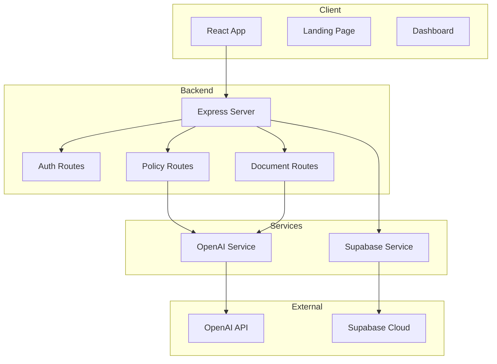

# PolicySphere AI — System Architecture

## Overview

PolicySphere AI is a full-stack policy analysis platform combining AI agents with modern web technologies to deliver enterprise-grade policy risk assessment.

---

## High-Level Architecture

```
┌─────────────────────────────────────────────────────────────────────────────┐
│                              PRESENTATION LAYER                              │
│  ┌─────────────────────────────────────────────────────────────────────┐   │
│  │                         Frontend (Vite + React)                      │   │
│  │  ┌─────────┐  ┌─────────┐  ┌──────────┐  ┌──────────┐  ┌─────────┐  │   │
│  │  │ Landing │  │Dashboard│  │ Simulator│  │Document  │  │ Reports │  │   │
│  │  │  Page   │  │         │  │          │  │ Analyzer │  │         │  │   │
│  │  └─────────┘  └─────────┘  └──────────┘  └──────────┘  └─────────┘  │   │
│  │                                                                       │   │
│  │  • SPA (Single Page Application)                                     │   │
│  │  • Chart.js for visualizations                                      │   │
│  │  • html2pdf for report generation                                   │   │
│  │  • Responsive design (mobile-first)                                  │   │
│  └─────────────────────────────────────────────────────────────────────┘   │
└───────────────────────────────────────────────────────────┬─────────────────┘
                                                            │
                                                    HTTPS (443)
                                                            │
┌───────────────────────────────────────────────────────────▼─────────────────┐
│                              API GATEWAY LAYER                               │
│  ┌─────────────────────────────────────────────────────────────────────┐   │
│  │                      Backend (Express.js)                           │   │
│  │  ┌─────────────┐  ┌─────────────┐  ┌─────────────┐  ┌───────────┐  │   │
│  │  │   Routes    │  │ Controllers │  │ Middleware  │  │  Services │  │   │
│  │  │  • /auth    │  │  • Auth     │  │  • Auth     │  │  • OpenAI │  │   │
│  │  │  • /policy  │  │  • Policy   │  │  • CORS     │  │  • Supabase│  │   │
│  │  │  • /document│  │  • Document │  │  • Rate     │  │  • Valid. │  │   │
│  │  │  • /user    │  │  • User     │  │  • Helmet   │  │           │  │   │
│  │  └─────────────┘  └─────────────┘  └─────────────┘  └───────────┘  │   │
│  │                                                                       │   │
│  │  • REST API (JSON)                                                    │   │
│  │  • JWT Authentication                                                 │   │
│  │  • Request validation                                                 │   │
│  │  • Error handling                                                     │   │
│  └─────────────────────────────────────────────────────────────────────┘   │
└───────────────────────────────────────────────────────────┬─────────────────┘
                                                            │
                           ┌────────────────────────────────┴───────────────┐
                           │                   SERVICE LAYER                  │
                           │  ┌──────────────────┐  ┌──────────────────┐    │
                           │  │  OpenAI Service  │  │ Supabase Service │    │
                           │  │                  │  │                  │    │
                           │  │  • GPT-4 Turbo   │  │  • Auth (JWT)    │    │
                           │  │  • GPT-4o        │  │  • Database      │    │
                           │  │  • Embeddings    │  │  • Row Level Sec │    │
                           │  │  • Function Call  │  │  • Storage       │    │
                           │  │                  │  │                  │    │
                           │  │  • Policy Expert │  │  • User Mgmt     │    │
                           │  │  • Document AI    │  │  • Data Persist  │    │
                           │  └──────────────────┘  └──────────────────┘    │
                           └────────────────────────────────────────────────┘
                                                            │
                           ┌────────────────────────────────┴───────────────┐
                           │                    DATA LAYER                     │
                           │  ┌────────────────────────────────────────────┐ │
                           │  │                  Supabase                   │ │
                           │  │  ┌──────────┐  ┌──────────┐  ┌─────────┐  │ │
                           │  │  │  Users    │  │Analyses │  │ Reports │  │ │
                           │  │  │  Table    │  │  Table   │  │  Table  │  │ │
                           │  │  └──────────┘  └──────────┘  └─────────┘  │ │
                           │  │  ┌──────────┐  ┌──────────┐  ┌─────────┐  │ │
                           │  │  │Documents │  │ Policy   │  │ Sessions│  │ │
                           │  │  │  Table   │  │Templates │  │  Table  │  │ │
                           │  │  └──────────┘  └──────────┘  └─────────┘  │ │
                           │  └────────────────────────────────────────────┘ │
                           └────────────────────────────────────────────────┘
```

---

## Technology Stack

### Frontend
| Technology | Version | Purpose |
|------------|---------|---------|
| React | 18.x | UI Framework |
| Vite | 6.x | Build Tool |
| Chart.js | 4.x | Data Visualization |
| html2pdf.js | 0.10 | PDF Generation |
| CSS3 | - | Styling |
| Google Fonts | - | Typography |

### Backend
| Technology | Version | Purpose |
|------------|---------|---------|
| Node.js | 20.x | Runtime |
| Express.js | 4.x | Web Framework |
| OpenAI SDK | 4.x | AI Integration |
| Supabase JS | 2.x | Database Client |
| JSON Web Token | 9.x | Authentication |
| Helmet | 7.x | Security Headers |
| express-validator | 7.x | Input Validation |
| express-rate-limit | 7.x | Rate Limiting |

### Infrastructure
| Service | Purpose |
|---------|---------|
| Supabase | Database, Auth, Storage |
| OpenAI | AI Models (GPT-4) |
| Vercel | Frontend Hosting |
| Render/Railway | Backend Hosting |

---

## Component Diagram

```
┌─────────────────────────────────────────────────────────────────────────────┐
│                              FRONTEND COMPONENTS                            │
└─────────────────────────────────────────────────────────────────────────────┘

   ┌──────────────┐     ┌──────────────┐     ┌──────────────┐
   │   Landing    │     │  Dashboard   │     │    Login     │
   │    Page      │     │    Page      │     │    Modal     │
   └──────┬───────┘     └──────┬───────┘     └──────┬───────┘
          │                    │                    │
          └────────────────────┴────────────────────┘
                               │
                               ▼
                    ┌─────────────────────┐
                    │   Main Application  │
                    │   (src/main.js)     │
                    └──────────┬──────────┘
                               │
          ┌────────────────────┴────────────────────┐
          │                                         │
          ▼                                         ▼
┌─────────────────────┐                 ┌─────────────────────┐
│    API Client      │                 │    State Manager    │
│   (src/api.js)     │                 │   (Context/Hooks)   │
└─────────┬───────────┘                 └─────────────────────┘
          │
          └──────────────┬──────────────────┘
                         │
                         ▼
┌─────────────────────────────────────────────────────────────────────────────┐
│                              BACKEND COMPONENTS                              │
└─────────────────────────────────────────────────────────────────────────────┘

   ┌─────────────────────────────────────────────────────────────────────┐
   │                          Express Server (server.js)                  │
   └─────────────────────────────────────┬───────────────────────────────┘
                                         │
    ┌──────────────┬──────────────┬──────────────┬──────────────┐
    │              │              │              │              │
    ▼              ▼              ▼              ▼              ▼
┌─────────┐  ┌─────────┐  ┌─────────┐  ┌─────────┐  ┌─────────┐
│  Auth   │  │ Policy  │  │Document │  │  User   │  │ Health  │
│ Routes  │  │ Routes  │  │ Routes  │  │ Routes  │  │ Routes  │
└────┬────┘  └────┬────┘  └────┬────┘  └────┬────┘  └────┬────┘
     │            │            │            │            │
     ▼            ▼            ▼            ▼            ▼
┌─────────┐  ┌─────────┐  ┌─────────┐  ┌─────────┐  ┌─────────┐
│  Auth   │  │ Policy  │  │Document │  │  User   │  │   -     │
│Controller│ │Controller│ │Controller│ │Controller│ │         │
└────┬────┘  └────┬────┘  └────┬────┘  └────┬────┘  └────┬────┘
     │            │            │            │            │
     └────────────┴────────────┴────────────┴────────────┘
                          │
                          ▼
              ┌───────────────────────────┐
              │      Service Layer         │
              │  ┌─────────┐ ┌──────────┐  │
              │  │ OpenAI  │ │ Supabase │  │
              │  │ Service │ │ Service  │  │
              │  └─────────┘ └──────────┘  │
              └───────────────────────────┘
```

---

## Data Flow

### 1. User Authentication Flow
```
User → Login Form → POST /api/auth/login 
  → AuthController.login() 
  → SupabaseAuth.signIn() 
  → JWT Token Generated 
  → Response to Client 
  → Store Token (localStorage)
```

### 2. Policy Analysis Flow
```
User → Policy Form → POST /api/policy/analyze 
  → Auth Middleware (verify JWT)
  → PolicyController.analyze()
  → OpenAI Service.analyzePolicy(policyData)
    → GPT-4 with system prompt
    → Parse response
    → Calculate risk scores
  → Save to Supabase (analyses table)
  → Return analysis result
```

### 3. Document Analysis Flow
```
User → Upload Document → POST /api/document/analyze-text
  → Auth Middleware
  → DocumentController.analyzeText()
  → OpenAI Service.analyzeDocument(text)
    → Extract key information
    → Generate summary
    → Answer questions
  → Save to Supabase (documents table)
  → Return results
```

### 4. Report Generation Flow
```
User → Request Report → GET /api/analyses/:id
  → Auth Middleware
  → UserController.getAnalysis()
  → Fetch from Supabase
  → Generate PDF (html2pdf)
  → Return PDF to user
```

---

## Database Schema

### Supabase Tables

```sql
-- Users table (extends Supabase auth.users)
CREATE TABLE public.profiles (
  id UUID PRIMARY KEY REFERENCES auth.users(id),
  email TEXT NOT NULL,
  username TEXT,
  created_at TIMESTAMP DEFAULT NOW(),
  settings JSONB DEFAULT '{}'
);

-- Analyses table
CREATE TABLE public.analyses (
  id UUID PRIMARY KEY DEFAULT gen_random_uuid(),
  user_id UUID REFERENCES public.profiles(id),
  title TEXT NOT NULL,
  policy_type TEXT NOT NULL,
  sector TEXT NOT NULL,
  magnitude INTEGER NOT NULL,
  duration TEXT NOT NULL,
  impacts JSONB NOT NULL,
  risk_score INTEGER NOT NULL,
  decision TEXT NOT NULL,
  explanation TEXT,
  created_at TIMESTAMP DEFAULT NOW()
);

-- Documents table
CREATE TABLE public.documents (
  id UUID PRIMARY KEY DEFAULT gen_random_uuid(),
  user_id UUID REFERENCES public.profiles(id),
  title TEXT NOT NULL,
  content TEXT,
  summary TEXT,
  created_at TIMESTAMP DEFAULT NOW()
);

-- Reports table
CREATE TABLE public.reports (
  id UUID PRIMARY KEY DEFAULT gen_random_uuid(),
  user_id UUID REFERENCES public.profiles(id),
  analysis_id UUID REFERENCES public.analyses(id),
  pdf_url TEXT,
  created_at TIMESTAMP DEFAULT NOW()
);
```

### Row Level Security (RLS)
```sql
-- Enable RLS
ALTER TABLE public.profiles ENABLE ROW LEVEL SECURITY;
ALTER TABLE public.analyses ENABLE ROW LEVEL SECURITY;
ALTER TABLE public.documents ENABLE ROW LEVEL SECURITY;
ALTER TABLE public.reports ENABLE ROW LEVEL SECURITY;

-- Profiles: Users can only see their own profile
CREATE POLICY "Users can view own profile" ON profiles
  FOR SELECT USING (auth.uid() = id);

-- Analyses: Users can only see their own analyses
CREATE POLICY "Users can view own analyses" ON analyses
  FOR ALL USING (auth.uid() = user_id);
```

---

## Security Architecture

```
┌─────────────────────────────────────────────────────────────────────────────┐
│                            SECURITY LAYERS                                    │
└─────────────────────────────────────────────────────────────────────────────┘

┌─────────────────┐
│ 1. Network      │  ← HTTPS (TLS 1.3), WAF, DDoS Protection
└────────┬────────┘
         │
┌────────▼────────┐
│ 2. Application  │  ← Helmet (Security Headers), CORS, Rate Limiting
└────────┬────────┘
         │
┌────────▼────────┐
│ 3. API         │  ← JWT Validation, Input Validation, Request Sanitization
└────────┬────────┘
         │
┌────────▼────────┐
│ 4. Database    │  ← RLS (Row Level Security), Parameterized Queries
└────────┬────────┘
         │
┌────────▼────────┐
│ 5. AI/ML       │  ← Prompt Injection Protection, Output Validation
└─────────────────┘
```

### Security Headers (Helmet)
```javascript
{
  contentSecurityPolicy: { ... },
  crossOriginEmbedderPolicy: false,
  crossOriginResourcePolicy: { policy: "cross-origin" },
  crossOriginOpenerPolicy: { policy: "same-origin" },
  hidePoweredBy: true,
  hsts: { maxAge: 31536000, includeSubDomains: true },
  noSniff: true,
  xssFilter: true,
  permittedPolicies: "fullscreen"
}
```

### Rate Limiting
- **Authentication**: 5 requests/minute
- **API Requests**: 100 requests/15 minutes
- **AI Requests**: 20 requests/minute

---

## Deployment Architecture

```
┌─────────────────────────────────────────────────────────────────────────────┐
│                            DEPLOYMENT SETUP                                  │
└─────────────────────────────────────────────────────────────────────────────┘

┌─────────────────────────┐         ┌─────────────────────────┐
│     Development         │         │      Production          │
├─────────────────────────┤         ├─────────────────────────┤
│  Local: localhost:3000  │         │  Frontend: Vercel        │
│  Backend: localhost:5173│         │  Backend: Render/Railway│
│  Database: Local SQLite  │         │  Database: Supabase Cloud│
└─────────────────────────┘         └─────────────────────────┘
                                      │
                                      ▼
┌─────────────────────────────────────────────────────────────────────────────┐
│                             PRODUCTION ENVIRONMENT                           │
└─────────────────────────────────────────────────────────────────────────────┘

                    ┌──────────────────────┐
                    │   CDN (Cloudflare)   │
                    │   (SSL, Cache)       │
                    └──────────┬───────────┘
                               │
              ┌────────────────┼────────────────┐
              │                │                │
              ▼                ▼                ▼
     ┌────────────┐   ┌────────────┐   ┌────────────┐
     │  Frontend  │   │  Backend   │   │  Database  │
     │  (Vercel)  │   │  (Render)  │   │ (Supabase) │
     │            │   │            │   │            │
     │  - Static  │   │  - Node.js │   │  - Postgres│
     │  - CDN     │   │  - Express │   │  - Auth    │
     │  - Edge    │   │  - Auto-   │   │  - Storage │
     │            │   │    scale   │   │  - Edge    │
     └────────────┘   └────────────┘   └────────────┘
                               │
                               ▼
                    ┌──────────────────────┐
                    │   OpenAI API          │
                    │   (GPT-4 Turbo)       │
                    └──────────────────────┘
```

---

## Environment Variables

### Backend (.env)
```env
# Supabase
SUPABASE_URL=https://your-project.supabase.co
SUPABASE_ANON_KEY=your-anon-key
SUPABASE_SERVICE_ROLE_KEY=your-service-role-key

# OpenAI
OPENAI_API_KEY=sk-your-openai-key

# JWT
JWT_SECRET=your-super-secret-jwt-key

# App
NODE_ENV=production
PORT=3000
```

### Frontend (.env)
```env
VITE_API_URL=https://your-backend.onrender.com
VITE_SUPABASE_URL=https://your-project.supabase.co
VITE_SUPABASE_ANON_KEY=your-anon-key
```

---

## Monitoring & Logging

### Backend Logging
- **Morgan**: HTTP request logging
- **Winston**: Application logging
- **Error Tracking**: Console + file

### Health Checks
```
GET /api/health
Response: { status: "ok", timestamp: "...", uptime: ... }
```

---

## Scalability Considerations

| Component | Current | Scaling Strategy |
|-----------|---------|------------------|
| Frontend | Vercel | Auto-scale, CDN |
| Backend | Render | Vertical + Horizontal |
| Database | Supabase | Read replicas, Connection pooling |
| AI | OpenAI | Rate limiting, Caching |

---

## File Structure

```
PolicySphere AI/
├── frontend/
│   ├── src/
│   │   ├── main.js          # Entry point
│   │   ├── api.js           # API client
│   │   └── ...
│   ├── index.html           # HTML entry
│   ├── style.css            # Styles
│   ├── assets/              # Images, fonts
│   └── package.json
│
├── backend/
│   ├── src/
│   │   ├── server.js        # Express server
│   │   ├── config/          # Configuration
│   │   ├── routes/          # API routes
│   │   ├── controllers/     # Request handlers
│   │   ├── middleware/      # Auth, validation
│   │   ├── services/        # OpenAI, Supabase
│   │   └── utils/           # Helpers
│   ├── package.json
│   └── .env
│
├── SUPABASE_SETUP.md        # Database setup
├── AGENT_ARCHITECTURE.md    # AI agent design
└── SYSTEM_ARCHITECTURE.md   # This document
```

---

## Mermaid Diagram



---

*Last Updated: April 2026*
*Version: 1.0.0*